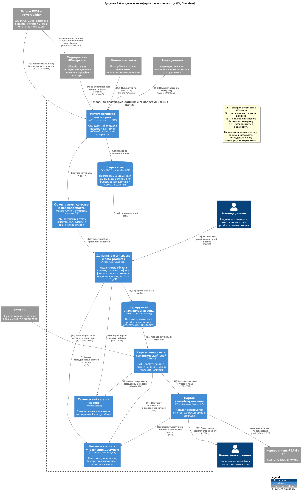

# Задание 1. Целевая архитектура «Будущего 2.0»

## Что предлагается

Через год у компании появляется общая облачная платформа данных, но команды не складывают новую бизнес-логику в один общий DWH. Каждый домен — клиники и головной офис, финтех, а затем фарма и оборудование — отвечает за свой **data product**: входной контракт, преобразования, качество, описание и правила доступа.

Общими остаются только платформенные возможности: приём данных, дешёвая сырая зона, аналитическое хранилище, каталог, семантический слой, контроль доступа, оркестрация и портал самообслуживания. Благодаря этому метрики компании можно свести в одном месте, не лишая домены возможности развиваться и выпускаться независимо.

Исходные медицинские данные — медкарты, истории болезни, снимки и результаты исследований — намеренно находятся **за границей аналитической платформы**. Они передаются медицинским ИИ-сервисам по отдельному защищённому каналу. В платформу могут поступать только явно разрешённые операционные показатели клиник и обезличенные метрики работы ИИ.

Легаси DWH и PowerBuilder можно временно оставить для сценариев, которые не успеют перенести за год. Данные из него поступают в новую платформу через CDC или пакетные выгрузки, но новая бизнес-логика в SQL Server 2008 больше не добавляется.

## C4-диаграмма контейнеров

Исходник диаграммы: [`task1.puml`](./task1.puml).

Обозначения бизнес-сценариев на связях:

- **S1 — быстрая отчётность и self-service.** Пользователь находит разрешённые данные в каталоге и строит отчёт через единый семантический слой. Интерактивные запросы не конкурируют с записью в операционный DWH; для частых отчётов можно использовать агрегаты и кеш.
- **S2 — независимое развитие доменов.** У каждого домена отдельные pipeline, workspace, права, вычислительные квоты и цикл поставки. Общие показатели публикуются как версионируемые data products с контрактом.
- **S3 — подключение нового бизнеса.** Фармацевтическая компания или производитель оборудования реализует стандартный API, event/batch-контракт и получает свою изолированную зону. Для этого не нужно менять бизнес-логику общего DWH.
- **S4 — безопасная и надёжная работа.** На схеме сценарий показан сквозными компонентами: IAM, policy engine, аудит, изоляция зон и workload, мониторинг и контроль качества. Для критичных контейнеров в облаке нужны multi-AZ, резервные копии и проверяемое восстановление.

## Выбранный технологический стек

| Задача                             | Технология         | Роль в решении                                                                                                          |
| ---------------------------------- | ------------------ | ----------------------------------------------------------------------------------------------------------------------- |
| Объектное S3-совместимое хранилище | **MinIO**          | Хранит сырые данные и файлы курируемых таблиц в разных bucket и зонах доступа                                           |
| Формат курируемых таблиц           | **Apache Iceberg** | Даёт таблицам схему, снимки и атомарное обновление поверх файлов в MinIO                                                |
| Технический каталог Iceberg        | **Project Nessie** | Хранит ссылки и версии метаданных Iceberg; используется обработкой и Dremio                                             |
| Оркестрация ETL/ELT                | **Apache Airflow** | Запускает доменные DAG, следит за расписанием, зависимостями и SLA; сами преобразования выполняют SQL/Python/Spark jobs |
| Служебная БД Airflow               | **PostgreSQL**     | Хранит состояние Airflow, но не является корпоративным DWH или хранилищем data products                                 |
| SQL/query и первичный self-service | **Dremio**         | Читает Iceberg через Nessie, выполняет SQL и предоставляет API/UI для исследования данных и подключения Power BI        |
| Бизнес-каталог                     | **DataHub**        | Описывает владельцев, термины, контракты и lineage; не хранит сами данные                                               |

## Почему отчётность должна стать быстрее

| Изменение                                        | Что оно даёт                                                                                                |
| ------------------------------------------------ | ----------------------------------------------------------------------------------------------------------- |
| Разделение операционной и аналитической нагрузки | Отчёты больше не отбирают ресурсы у системы операторов и наоборот                                           |
| Разделение хранения и вычислений                 | Вычислительные ресурсы можно увеличить на время тяжёлой обработки и независимо масштабировать разные домены |
| Курируемые витрины, агрегаты и кеш               | Частые показатели не пересчитываются из сырых данных при каждом открытии отчёта                             |
| Единый семантический слой                        | Метрика определяется один раз, а портал и Power BI используют одно и то же определение                      |
| Контракты и проверки качества на входе           | Ошибка источника обнаруживается до того, как попадёт в управленческий отчёт                                 |

## Проблемные места текущего решения

| ID | Проблема | Какие бизнес-сценарии страдают | Последствие |
|---|---|---|---|
| P1 | Легаси DWH на SQL Server 2008 вместе с PowerBuilder совмещает операционную БД, хранилище и бизнес-логику | S1, S2, S3, S4 | Общий узел трудно масштабировать и поддерживать; любое изменение имеет большой радиус влияния и задерживает команды |
| P2 | Операционные, ETL- и BI-нагрузки конкурируют за ресурсы одного DWH, а self-service заменён множеством BI-кастомизаций | S1 | Сложные отчёты строятся часами, новые срезы требуют участия IT, управленческие решения запаздывают |
| P3 | У доменов нет автономных data products и контрактов, а старая ESB остаётся общей точкой интеграции | S2, S3, S4 | Финтех и ИИ зависят от общей модели; подключение фармы или оборудования требует изменений центральных компонентов |
| P4 | Не определены владельцы данных, единый каталог, lineage, проверки качества и общие определения метрик | S1, S2, S4 | Одинаковые показатели считаются по-разному, ошибкам трудно найти источник, отчётам сложно доверять |
| P5 | Медицинские, финансовые и корпоративные данные недостаточно разделены; не сформированы облачные SLO, наблюдаемость и DR-процедуры | S1, S4 | Возникают риски лишнего доступа, нарушения требований регуляторов и недоступности критичных сервисов |

## Приоритизация по MoSCoW

Приоритет присвоен по влиянию на годовые бизнес-цели: портал должен заработать, домены — получить самостоятельность, а медицинские и банковские данные — остаться защищёнными.

| ID | Приоритет | Минимальный объём решения на год | Почему такой приоритет |
|---|---|---|---|
| P2 | **Must** | Отделить аналитическую нагрузку, создать курируемые витрины, Dremio и первую версию портала | Без этого не будет быстрой отчётности и self-service — главного результата года |
| P3 | **Must** | Запустить отдельные доменные workspace и контракты хотя бы для клиник и финтеха; новые потоки подключать через API/events/CDC | Это необходимо для независимого развития направлений и подключения новых компаний |
| P4 | **Must** | Назначить владельцев ключевых наборов, завести DataHub, общие определения метрик и автоматические проверки качества | Self-service без понятных и надёжных данных ускорит получение неправильных отчётов |
| P5 | **Must** | Разделить зоны и права, подключить IAM/MFA, шифрование и аудит; ввести SLO, мониторинг, резервное копирование и проверку восстановления | Ошибка угрожает пациентам, банковской лицензии и доступности критичных сервисов |
| P1 | **Should** | Не добавлять в легаси новую логику и перенести с него основную аналитику; временно оставить его системой учёта и источником CDC | Полный вывод снижает риски и стоимость поддержки, но не обязателен для запуска портала за год |

К уровню **Could** относятся расширенная оптимизация затрат, георепликация некритичных компонентов и перенос редких легаси-интеграций. В **Won't this year** входят полное отключение DWH, PowerBuilder и ESB одним переключением, а также перевод всех источников в real-time. Медкарты, истории болезни, снимки и результаты исследований не будут загружаться в аналитическую платформу ни на этом, ни на следующих этапах.
