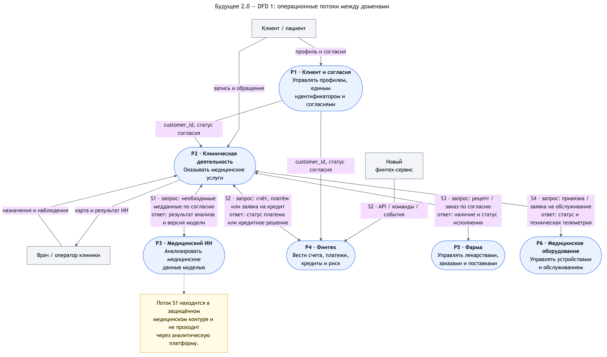
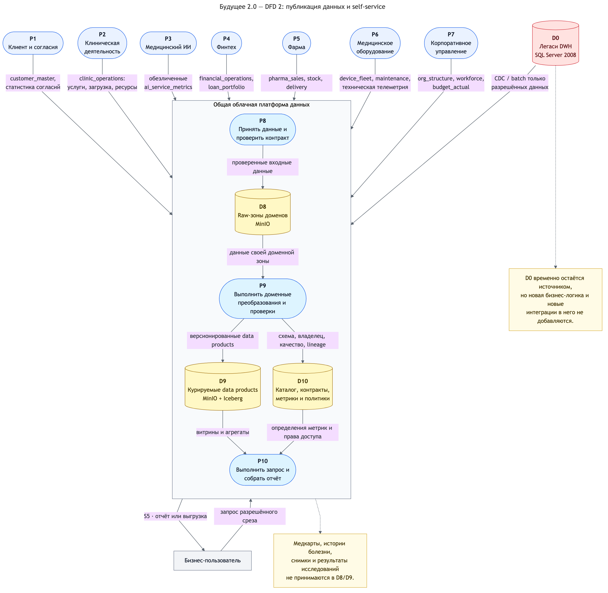

# Задание 2. Домены и потоки данных «Будущего 2.0»

## Предлагаемое разделение

Систему предлагается делить по бизнес-возможностям, у которых есть свой владелец, операционные процессы и данные.

Облачная платформа данных не является ещё одним бизнес-доменом. Она предоставляет доменам одинаковые технические средства загрузки, хранения, контроля качества, публикации и поиска данных. Смысл и преобразования конкретного набора остаются ответственностью команды домена.

| Домен                        | За что отвечает                                                                                                   | Основные хранилища и публикуемые data products                                                                                           | Что остаётся за границей                                                                                                                       |
| ---------------------------- | ----------------------------------------------------------------------------------------------------------------- | ---------------------------------------------------------------------------------------------------------------------------------------- | ---------------------------------------------------------------------------------------------------------------------------------------------- |
| **Клиент и согласия**        | Единый идентификатор клиента, поиск дублей, контакты, согласия и цели обработки                                   | Операционный профиль; `customer_master`, статусы согласий и обезличенная статистика                                                      | Медицинская история, счета, кредиты и история покупок                                                                                          |
| **Клиническая деятельность** | Запись на приём, оказание медицинских услуг, работа врача, клиническая карта и использование ресурсов клиник      | Защищённое медицинское хранилище; `clinic_operations`, загрузка клиник, оказанные услуги и ресурсные показатели                          | Банковские операции, модели ИИ, продажи лекарств. Медкарты, истории болезни и результаты исследований не публикуются в аналитическую платформу |
| **Медицинский ИИ**           | Приём задания на анализ, запуск модели, выдача результата врачу, реестр версий моделей и наблюдение за их работой | Защищённое хранилище заданий и результатов; `ai_service_metrics` с обезличенными показателями качества, задержек и использования моделей | Первичная клиническая карта как data product и финансовые решения                                                                              |
| **Финтех**                   | Счета, платежи, кредиты, риск и банковская отчётность                                                             | Банковские операционные БД; `financial_operations`, `loan_portfolio`, расчёты и платежные статусы                                        | Диагнозы, назначения и внутреннее устройство клинического процесса                                                                             |
| **Фарма**                    | Каталог лекарств, остатки, заказ, продажа и поставка                                                              | Операционная БД фарм-компании; `pharma_sales`, `medicine_stock`, показатели поставок                                                     | Медицинская карта пациента; для исполнения рецепта передаётся только необходимый минимум по согласию                                           |
| **Медицинское оборудование** | Реестр устройств, поставка, ввод в эксплуатацию, обслуживание и техническая телеметрия                            | Реестр и телеметрия; `device_fleet`, `maintenance`, технические показатели надёжности                                                    | Результаты исследований и измерения, связанные с пациентом, не попадают в аналитическую витрину                                                |
| **Корпоративное управление** | Организационная структура, персонал, бюджеты, общехозяйственный инвентарь и корпоративные справочники             | Корпоративные системы; `org_structure`, `workforce`, `budget_actual`, общие справочники                                                  | Доменные операции клиник, банка и партнёров; сквозные KPI собираются в семантическом слое, а не записываются обратно в домен                   |

Такое деление не требует сразу создавать семь отдельных платформ или семь команд. Достаточно назначить владельца данных, выделить отдельные схемы/bucket и права, а также дать каждому домену независимый pipeline и контракт публикации. Если финтех или фарма вырастут, их можно будет позже разделить на более мелкие поддомены без изменения общей схемы взаимодействия.

## Правила взаимодействия доменов

- Операционный запрос, которому нужен немедленный ответ, проходит через версионируемый API. Например, клиника отправляет платёжный запрос в финтех и получает статус.
- Изменение состояния публикуется событием. Например, финтех отправляет `PaymentCompleted`, а домен оборудования — `DeviceMaintenanceRequired`.
- Пакетная загрузка и CDC допустимы для миграции с SQL Server 2008 и для источников, которым не нужен real-time.
- Домен не даёт остальным прямой доступ к своим операционным таблицам. Для аналитики он публикует проверенный data product с владельцем, схемой, SLA, классификацией и правилами доступа.
- Общие атрибуты клиента связываются через `customer_id`. При этом домен «Клиент и согласия» не собирает у себя полную медицинскую или финансовую историю.
- Медицинские данные для работы ИИ передаются напрямую между клиническим и ИИ-контурами по защищённому API. Этот поток не проходит через аналитическое озеро, Dremio или портал.

## Data Flow Diagram

Чтобы связи оставались читаемыми, DFD разделена на два согласованных представления. На схемах прямоугольниками показаны внешние участники, овалами — процессы, цилиндрами — хранилища. В первой части операционные хранилища опущены: их владельцы и состав приведены в таблице доменов. Подпись двунаправленного потока отдельно показывает данные запроса и ответа.

### DFD 1. Операционные обмены между доменами

Здесь показаны потоки, необходимые непосредственно для оказания услуги. Медицинский обмен S1 идёт по защищённому каналу и не проходит через аналитическую платформу.

### DFD 2. Публикация данных и self-service

`D0` — временно сохраняемый легаси-DWH, а `D8–D10` относятся к общей платформе данных. Все новые и изменяемые потоки приходят от доменов по контрактам; `D0` используется только как миграционный источник CDC/batch.

### Как проходят ключевые сценарии

| Сценарий | Поток данных | Почему не требуется новая логика в DWH |
|---|---|---|
| **S1. ИИ анализирует медицинские данные** | Врач создаёт задание в клиническом домене → клиника проверяет цель и согласие → по защищённому API передаёт в ИИ необходимые медицинские данные → ИИ возвращает результат в клиническую систему. В платформу попадают только обезличенные показатели работы модели | DWH не маршрутизирует задание и не выполняет преобразования; медицинский обмен идёт между двумя доменными API |
| **S2. Подключается новый финтех-сервис** | Новый сервис использует API/events финтех-домена → операции сохраняются в банковской БД → домен публикует события и обновляет свой `financial_operations` → разрешённые показатели становятся доступны в портале | Меняется контракт и pipeline финтех-домена, но не таблицы и процедуры центрального DWH |
| **S3. Подключается фарм-компания** | Клиника передаёт минимально необходимый электронный рецепт или заказ по согласию → фарма возвращает статус исполнения → продажи, остатки и поставки публикуются как отдельные data products | Фарм-домен получает собственное хранилище, зону, права и шаблон подключения; DWH не расширяется фармацевтической моделью |
| **S4. Подключается производитель оборудования** | Производитель ведёт реестр устройств и техническую телеметрию → клиника получает статус оборудования, а производитель — заявку на обслуживание → технические показатели публикуются в платформу | Новый поток реализуется контрактами доменов клиники и оборудования. Результаты исследований пациента в витрину не передаются |
| **S5. Пользователь строит сквозной отчёт** | Разрешённые данные доменов → проверка входного контракта → изолированные raw-зоны → доменные преобразования → курируемые data products → семантический слой и контроль доступа → портал или Power BI | Отчёт выполняется на аналитической платформе. DWH остаётся только одним из временных источников CDC и не обслуживает новые отчёты |

## Почему домены можно развивать независимо

У каждого домена есть четыре явные границы: собственная операционная модель, владелец, входные API/events и опубликованные data products. Изменения внутри границы не требуют согласованного релиза всех остальных систем, пока сохраняются версии контрактов. Например, банк может изменить расчёт риска или внутреннюю схему транзакций, не затрагивая клинику; потребителям важны только стабильные `CreditDecision` и `financial_operations`.

Общие сквозные показатели не переносятся в центральную бизнес-модель. Владелец каждого домена публикует атомарные, понятные показатели, а согласованные формулы вроде общей выручки группы задаются в семантическом слое Dremio. Так сохраняется целостная отчётность, но платформенная команда не забирает у доменов всю бизнес-логику.

## Польза для бизнеса

| Результат                                | За счёт чего достигается                                                                                                                        |
| ---------------------------------------- | ----------------------------------------------------------------------------------------------------------------------------------------------- |
| Быстрее выводятся продукты               | Команда меняет свой сервис и pipeline; очередь изменений общего DWH больше не является обязательным этапом релиза                               |
| Проще покупать и подключать компании     | Новый партнёр получает типовой набор: доменный workspace, API/event/batch-контракт, raw-зону, шаблон проверок и запись в каталоге               |
| Направления масштабируются отдельно      | Хранилище, вычислительные квоты, права и расписания разделены; тяжёлая обработка финтеха не должна замедлять клиническую аналитику              |
| Отчётность становится быстрее и понятнее | Портал читает подготовленные data products и агрегаты, а не запускает множество преобразований на операционном DWH                              |
| Снижается риск лишнего доступа           | Медицинские, банковские и партнёрские данные физически и логически разделены; портал применяет политики на уровне набора, строк и колонок       |
| Легаси можно выводить постепенно         | CDC и пакетные выгрузки позволяют переносить сценарии по одному, не связывая запуск портала с полным отключением PowerBuilder и SQL Server 2008 |

Цена такого решения — необходимость управлять версиями контрактов, качеством и дублированием справочных данных. Для этого нужны владельцы data products, автоматические проверки совместимости, каталог и единые правила идентификаторов. Это дополнительная дисциплина, но она локализует изменения и лучше масштабируется, чем возврат всей логики в одно хранилище.
