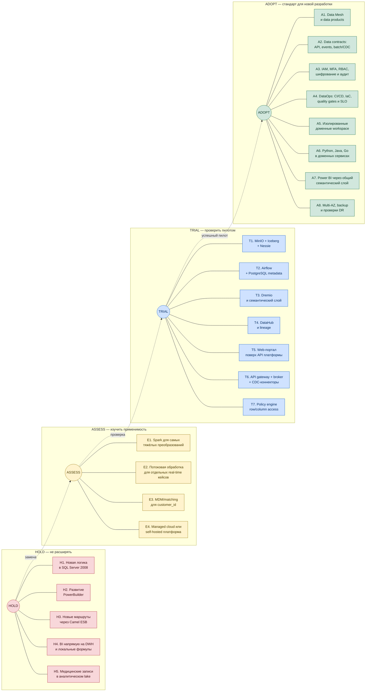
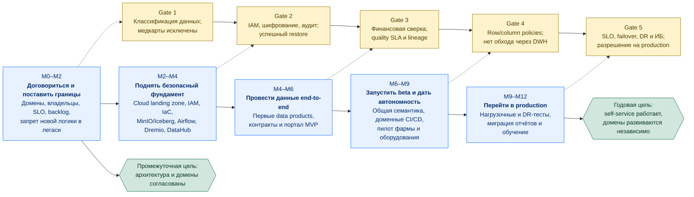
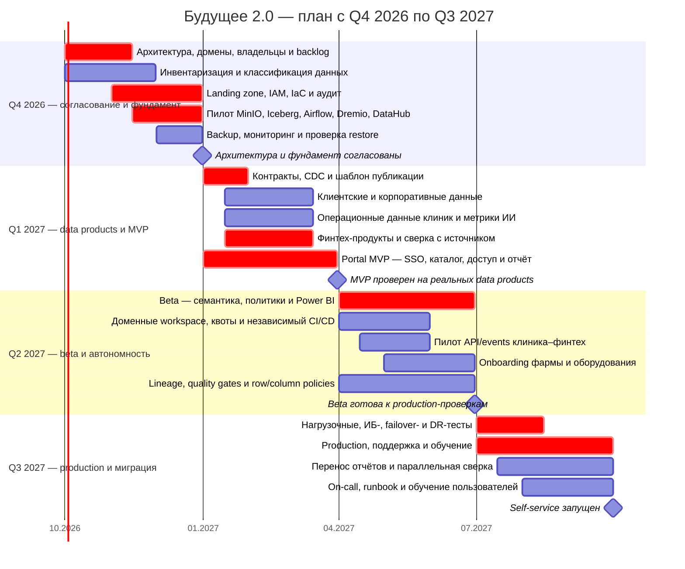

# Задание 3. Технологический радар и роадмап «Будущего 2.0»

## От чего отталкиваемся

В заданиях 1 и 2 уже выбрано направление: вместо дальнейшего наращивания общего DWH компания создаёт облачную платформу данных, а домены публикуют в неё собственные data products. Портал работает с курируемыми данными через единый семантический слой. SQL Server 2008, PowerBuilder и часть Apache Camel временно остаются, но не становятся основой новых решений.

Для проверки пользы технологий используются шесть бизнес-сценариев:

- **BS1 — быстрая отчётность и self-service:** сотрудник сам находит разрешённые данные и строит отчёт без очереди к IT.
- **BS2 — независимое развитие доменов:** клиника, финтех, ИИ и головной офис выпускают изменения без общего релиза DWH.
- **BS3 — подключение новых бизнесов:** фарма и производитель оборудования входят через типовые контракты и изолированные workspace.
- **BS4 — качество медицинских сервисов:** медицинский контур остаётся защищённым, работа ИИ наблюдаема, а запрещённые медицинские данные не попадают в аналитику.
- **BS5 — качество финансовых сервисов:** финансовые показатели сверяются с источником, доступ и изменения аудируются, критичные сервисы восстанавливаются в согласованные сроки.
- **BS6 — управляемая миграция и затраты:** компания переносит сценарии по частям, масштабирует вычисления независимо от хранения и не оплачивает бессрочное развитие легаси.

## Технологический радар

Радар показывает решение на начало программы. **Adopt** означает стандарт для новой разработки, **Trial** — обязательный пилот перед промышленным масштабированием, **Assess** — исследование только при подтверждённой потребности, **Hold** — запрет на расширение и постепенный вывод. Исходник схемы: [`task3_tech_radar.mmd`](./task3_tech_radar.mmd). Интерактивная версия на AOE Technology Radar и инструкция запуска находятся в [`tech_radar/`](./tech_radar/README.md).



### Adopt — использовать как правило

| ID | Технология или практика | Где применяется | Поддерживаемые сценарии |
|---|---|---|---|
| A1 | **Data Mesh и data products** | Домен владеет смыслом, pipeline, качеством, описанием и SLA своего набора; платформа даёт общие инструменты | BS1, BS2, BS3 |
| A2 | **Версионируемые data contracts, API, events, batch/CDC** | API — для запроса с немедленным ответом, events — для фактов, batch/CDC — для аналитики и миграции | BS2, BS3, BS6 |
| A3 | **IAM/SSO/MFA, RBAC, шифрование, secrets и аудит** | Единая идентичность, минимальные права, защищённые каналы и журнал действий во всех контурах | BS1, BS4, BS5 |
| A4 | **DataOps: Git, CI/CD, IaC, автоматические quality gates и SLO** | Pipeline и инфраструктура проходят одинаковые проверки и разворачиваются воспроизводимо | BS1, BS2, BS4, BS5, BS6 |
| A5 | **Изолированные доменные workspace, bucket, квоты и service account** | Тяжёлая обработка одного домена не забирает ресурсы и права другого | BS2, BS3, BS4, BS5 |
| A6 | **Python, Java и Go** | Сохраняются как рабочие языки ИИ- и финтех-сервисов; переписывание без бизнес-причины не требуется | BS2, BS4, BS5, BS6 |
| A7 | **Power BI через общий слой Dremio** | Существующие полезные отчёты остаются, но читают согласованные метрики, а не DWH напрямую | BS1, BS6 |
| A8 | **Multi-AZ, резервное копирование, проверка restore и DR-учения** | Критичные компоненты и данные имеют согласованные SLO, RPO/RTO и проверенный план восстановления | BS4, BS5 |

### Trial — проверить на первых data products

| ID  | Технология или практика                        | Что проверяем на пилоте                                                                                                       | Поддерживаемые сценарии |
| --- | ---------------------------------------------- | ----------------------------------------------------------------------------------------------------------------------------- | ----------------------- |
| T1  | **MinIO + Apache Iceberg + Project Nessie**    | Хранение сотен терабайт, разделение raw/curated, атомарные изменения, эволюцию схемы, time travel и восстановление метаданных | BS1, BS2, BS3, BS6      |
| T2  | **Apache Airflow + PostgreSQL metadata DB**    | Независимые доменные DAG, повторный запуск, SLA загрузок и изоляцию; PostgreSQL хранит только состояние Airflow               | BS1, BS2, BS3           |
| T3  | **Dremio**                                     | Скорость типовых и ad hoc-запросов, агрегаты и кеш, workload isolation, коннектор Power BI и единые определения KPI           | BS1, BS2, BS6           |
| T4  | **DataHub и технический lineage**              | Поиск наборов, владельцев, классификацию, контракт, качество и путь показателя до источника                                   | BS1, BS2, BS4, BS5      |
| T5  | **Web-портал поверх Dremio, DataHub и IAM**    | Поиск данных, запрос доступа, конструктор отчёта, сохранение и выгрузку без обхода политик                                    | BS1                     |
| T6  | **API gateway, event broker и CDC-коннекторы** | Одну интеграцию клиника–финтех, одну выгрузку из DWH и onboarding нового домена без изменения центральной БД                  | BS2, BS3, BS6           |
| T7  | **Policy engine и row/column policies**        | Маскирование, ограничения по строкам и атрибутам, deny-by-default и одинаковое применение правил в портале и Power BI         | BS1, BS4, BS5           |

Технология переходит из Trial в Adopt только после проверки производительности на реальном объёме, отказоустойчивости, поддержки командой и полной стоимости владения. Так выбор открытого стека из задания 1 остаётся целевым, но компания не принимает семь новых компонентов «на веру».

### Assess — не внедрять без отдельного кейса

| ID | Кандидат | Когда действительно понадобится | Поддерживаемые сценарии |
|---|---|---|---|
| E1 | **Apache Spark** | Если SQL/Python jobs и Dremio не укладываются в SLA тяжёлых преобразований; небольшой ETL не нужно автоматически переносить на Spark | BS1, BS2, BS6 |
| E2 | **Отдельный stream-processing engine** | Если измеренный бизнес-кейс требует обработки событий за секунды, например мониторинг критичной технической телеметрии | BS3, BS4, BS5 |
| E3 | **MDM/matching-платформа** | Если простых правил дедупликации недостаточно для устойчивого `customer_id` между клиникой, банком и новыми компаниями | BS1, BS3, BS4, BS5 |
| E4 | **Managed cloud против self-hosted компонентов** | После пилота сравнить доступность, требования регуляторов, компетенции и TCO; логическая архитектура от выбора провайдера не меняется | BS3, BS4, BS5, BS6 |

### Hold — остановить рост зависимости

| ID | Что замораживаем | Правило переходного периода | Поддерживаемые сценарии |
|---|---|---|---|
| H1 | **Новая бизнес-логика и новые витрины в SQL Server 2008** | DWH остаётся источником CDC/batch и временной системой учёта; перенос идёт по потребителям | BS1, BS2, BS3, BS6 |
| H2 | **Новые функции PowerBuilder** | Разрешены только критичные исправления до переноса операционного сценария | BS2, BS6 |
| H3 | **Новые интеграционные маршруты через централизованную Apache Camel ESB** | Существующие маршруты поддерживаются, новые интеграции идут через версионируемые API/events | BS2, BS3, BS6 |
| H4 | **Power BI напрямую на операционном DWH и отчётные локальные формулы** | Полезные отчёты переносятся на Dremio и общую семантику; дубликаты удаляются после сверки | BS1, BS5, BS6 |
| H5 | **Медкарты, истории болезни, снимки и результаты исследований в аналитической платформе** | Эти данные остаются в защищённом медицинском контуре и передаются ИИ напрямую; в платформе допустимы только разрешённые операционные и обезличенные метрики | BS4 |

Power BI одновременно присутствует в Adopt и Hold не случайно: сам инструмент можно сохранить, а способ его прямого подключения к DWH и размножение бизнес-формул нужно прекратить.

### Локальный запуск интерактивного радара

Интерактивная реализация находится в директории [`Task3/tech_radar`](./tech_radar/README.md) и использует **AOE Technology Radar 4.4.0**. Для повторения учебного примера рекомендуется Node.js 23.7.0 и npm 10.9.2. Версия Node указана в `.nvmrc`; при установленном `nvm` её можно выбрать командой `nvm use`.

Запуск из корня репозитория:

```bash
cd Task3/tech_radar
nvm use
npm ci
npm run serve
```

После запуска радар доступен по адресу <http://localhost:3000>. Если `nvm` не используется, команду `nvm use` можно пропустить и запустить проект на совместимой версии Node.js.

Для проверки production-сборки:

```bash
cd Task3/tech_radar
npm ci
npm run build
```

Результат создаётся в `Task3/tech_radar/build`. Директории `build`, `node_modules`, внутренний кеш `.techradar` и локальные логи исключены через `.gitignore`, поскольку восстанавливаются командами установки и сборки.

## Роадмап на год

Месяцы считаются от старта программы. Исходник схемы: [`task3_roadmap.mmd`](./task3_roadmap.mmd).



### Диаграмма Ганта

Ниже тот же план показан по квартальным диапазонам: от **Q4 2026** до **Q3 2027**. Условный старт программы — 1 октября 2026 года. Q4 отведён на согласование и фундамент, Q1 — на первые data products и MVP, Q2 — на beta и автономность доменов, Q3 — на production и миграцию. Исходник: [`task3_roadmap_gantt.mmd`](./task3_roadmap_gantt.mmd).



### Этапы, результаты и ресурсы

Оценки людей ориентировочные. Это не обязательно новые ставки: часть ролей можно выделить из текущих команд.

| Этап                                             | Основные работы                                                                                                                                                                                                                                                                                                      | Ожидаемый результат и критерий выхода                                                                                                                                                                                                                  | Кто ведёт                                                                                                      | Нужные ресурсы                                                                                                                                                                           |
| ------------------------------------------------ | -------------------------------------------------------------------------------------------------------------------------------------------------------------------------------------------------------------------------------------------------------------------------------------------------------------------- | ------------------------------------------------------------------------------------------------------------------------------------------------------------------------------------------------------------------------------------------------------ | -------------------------------------------------------------------------------------------------------------- | ---------------------------------------------------------------------------------------------------------------------------------------------------------------------------------------- |
| **1. М0–М2: договориться и поставить границы**   | Инвентаризировать DWH, BI и Camel; утвердить домены из задания 2, владельцев и первые data products; зафиксировать запрет новой логики в легаси; классифицировать данные; определить SLO/RPO/RTO и KPI программы                                                                                                     | Согласованы архитектура, границы, связи и backlog проектов. У каждого пилотного продукта есть владелец, контракт, класс данных и SLA. Медицинские данные, запрещённые для аналитики, перечислены явно                                                  | Архитектор программы и CDO/data governance; участвуют владельцы клиники, ИИ, финтеха, ИБ и compliance          | Архитектор и руководитель программы; data governance lead; по владельцу/аналитику от 4 первых доменов; ИБ и юрист/compliance part-time; каталог источников и время на интервью           |
| **2. М2–М4: безопасный фундамент**               | Создать cloud landing zone и отдельные dev/test/prod; настроить сеть, IAM/SSO/MFA, KMS/secrets, аудит, IaC и CI/CD; развернуть пилот MinIO/Iceberg/Nessie, Airflow, Dremio и DataHub; включить мониторинг, backup и первый restore-test                                                                              | Платформенный шаблон создаёт доменный workspace без ручной настройки. Доступ закрыт по умолчанию. Тест восстановления пройден, а базовые метрики доступности и стоимости собираются                                                                    | Руководитель платформы; участвуют cloud/platform, SRE и ИБ                                                     | Платформенная команда 5–7 инженеров, 2 SRE/DevOps, 1–2 специалиста ИБ; облачные тестовые квоты, multi-AZ, backup storage, CI runners и наблюдаемость                                     |
| **3. М4–М6: данные end-to-end и портал MVP**     | Подключить разрешённые данные DWH по CDC/batch; опубликовать `customer_master`, `clinic_operations`, `financial_operations`/`loan_portfolio`, корпоративные справочники и обезличенный `ai_service_metrics`; добавить схемы, тесты, lineage и сверку; реализовать SSO, поиск, запрос доступа и простую сборку отчёта | Один путь «источник → data product → Dremio → портал/Power BI» работает без прямого запроса к DWH. Финансовые итоги сверены с источником. Автопроверка не находит медкарт и результатов исследований в lake. Ошибка схемы блокирует публикацию         | Product owner портала и владельцы пилотных data products; участвуют платформа, аналитики, клиника, ИИ и финтех | Portal-команда 2–3 разработчика; по 2–3 инженера/аналитика от каждого пилотного домена; data steward; маскированные тестовые данные, CDC-коннектор, тестовый event broker/API gateway    |
| **4. М6–М9: beta и автономность доменов**        | Согласовать сквозные KPI в Dremio; добавить row/column policies, сохранённые отчёты, выгрузку и Power BI; выделить квоты и независимый CI/CD доменам; провести пилот API/events клиника–финтех; подключить по шаблону по одному безопасному набору фармы и оборудования; обучить beta-группу                         | Бизнес-пользователи сами строят разрешённые отчёты. Клиника и финтех выпускают pipeline независимо. Фарма/оборудование подключаются без изменений DWH. Популярные отчёты укладываются в согласованный SLA, а все обращения и выдачи доступа аудируются | Product owner портала и platform lead; владельцы доменов отвечают за свои продукты                             | Portal-команда 3–4 человека; data steward в каждом участвующем домене; UX/аналитик; представители фармы и оборудования; бюджет на обучение, нагрузочные тесты и раздельные compute-квоты |
| **5. М9–М12: production и управляемая миграция** | Провести нагрузочные, ИБ-, failover- и DR-тесты; настроить on-call и runbook; перевести приоритетные отчёты и пользователей; измерить использование; выключать старые ETL/BI-кастомизации только после сверки и периода параллельной работы                                                                          | Портал доступен целевой группе в production. SLO и согласованные RPO/RTO проверены учением. Основные отчёты больше не нагружают DWH. Для остатка легаси есть владелец, срок и план переноса; годовая цель достигнута без big bang                      | Руководитель программы и владельцы сервисов; production readiness подтверждают SRE, ИБ, клиника и финтех       | 2–3 SRE/поддержки, команда миграции 3–4 человека, service desk, представители аудита/compliance; production-квоты, DR-площадка, окно учений и план коммуникаций                          |

### Что именно нужно для запуска портала

Портал можно выпускать постепенно, не дожидаясь переноса всего DWH:

1. Войти через корпоративный SSO/MFA и получить роль из IAM.
2. Найти data product в DataHub, увидеть владельца, описание, качество и условия использования.
3. Запросить доступ; policy engine выдаёт минимальные права и сохраняет решение в аудите.
4. Собрать отчёт по опубликованным представлениям Dremio. Raw-зона и операционные базы пользователю недоступны.
5. Сохранить или выгрузить отчёт, либо открыть тот же семантический слой в Power BI.
6. Получить понятное сообщение о свежести данных и сбое, а владельцу продукта — alert при нарушении SLA.

Для первой production-версии не нужен универсальный low-code конструктор. Достаточно поиска, доступа, фильтров/срезов, сохранения отчёта, выгрузки и перехода в Power BI для сложной визуализации. Это уменьшает риск потратить год на интерфейс вместо работающего пути данных.

### Сквозные меры качества для медицины и финтеха

| Контроль                | Медицинский контур                                                                                                                                       | Финтех-контур                                                                                                               |
| ----------------------- | -------------------------------------------------------------------------------------------------------------------------------------------------------- | --------------------------------------------------------------------------------------------------------------------------- |
| **Граница данных**      | Медкарты, истории болезни, снимки и результаты исследований не проходят ingestion платформы; клиника и ИИ обмениваются ими по отдельному защищённому API | Банковские операционные таблицы не открываются порталу; публикуются только согласованные data products                      |
| **Проверки публикации** | Схема и DLP/классификация блокируют запрещённые поля; метрики ИИ обезличены                                                                              | Количество и суммы операций автоматически сверяются с системой-источником; расхождение блокирует публикацию отчёта          |
| **Эксплуатация**        | Версия модели, задержка и качество ИИ наблюдаемы; результат остаётся в клиническом процессе с участием врача                                             | Доступ, изменение расчёта и выгрузка аудируются; критичные операции имеют идемпотентность и контролируемый повтор           |
| **Надёжность**          | SLO и RPO/RTO задаются владельцем медицинского сервиса; restore и failover проверяются до production                                                     | SLO и RPO/RTO задаются владельцем банковского сервиса с учётом лицензии и отчётности; восстановление подтверждается учением |
| **Изменения**           | Несовместимая схема или новая цель обработки требует явного согласования                                                                                 | Версии контрактов, quality gates и параллельная сверка не дают тихо изменить финансовый показатель                          |

## Почему этапы идут именно так

| Этап                         | Зачем он нужен бизнесу                                                                                                                                     | Влияние на решения и сервис                                                                                              | Влияние на затраты и масштабирование                                                                                    |
| ---------------------------- | ---------------------------------------------------------------------------------------------------------------------------------------------------------- | ------------------------------------------------------------------------------------------------------------------------ | ----------------------------------------------------------------------------------------------------------------------- |
| **1. Границы и приоритеты**  | Без владельцев Data Mesh превратится в новое общее хранилище, за которое никто не отвечает. Инвентаризация позволяет выбрать отчёты, дающие быструю пользу | Единые определения KPI уменьшают споры о цифрах; ранняя классификация не даёт случайно вынести медданные в аналитику     | Компания не переносит сотни терабайт и все старые процедуры без разбора; появляется порядок вывода легаси               |
| **2. Безопасный фундамент**  | Масштабирование в облаке полезно только вместе с изоляцией, наблюдаемостью и восстановлением                                                               | IAM, аудит и restore уменьшают риск остановки клинических и банковских процессов; шаблоны ускоряют следующие подключения | Storage и compute масштабируются отдельно; IaC и типовой workspace уменьшают ручную поддержку                           |
| **3. End-to-end MVP**        | Небольшой набор реальных продуктов раньше показывает, работает ли архитектура и можно ли доверять данным                                                   | Руководители получают первые быстрые отчёты; lineage и сверка помогают быстрее найти источник ошибки                     | Ошибки стека обнаруживаются до массовой миграции, когда менять решение дешевле                                          |
| **4. Beta и автономность**   | Self-service начинает сокращать очередь к аналитикам, а шаблон нового домена проверяется на фарме и оборудовании                                           | Доменные команды меняют pipeline независимо; пользователи работают с одной семантикой и видят свежесть данных            | Квоты изолируют дорогие запросы, повторно используемый onboarding удешевляет каждое следующее приобретение              |
| **5. Production и миграция** | Ценность появляется только после перехода пользователей и закрепления операционной ответственности                                                         | SLO, on-call и DR повышают доступность; параллельная сверка сохраняет качество отчётов при переключении                  | После подтверждённого переноса можно выключать старые ETL и кастомизации; поэтапный вывод дешевле и безопаснее big bang |
