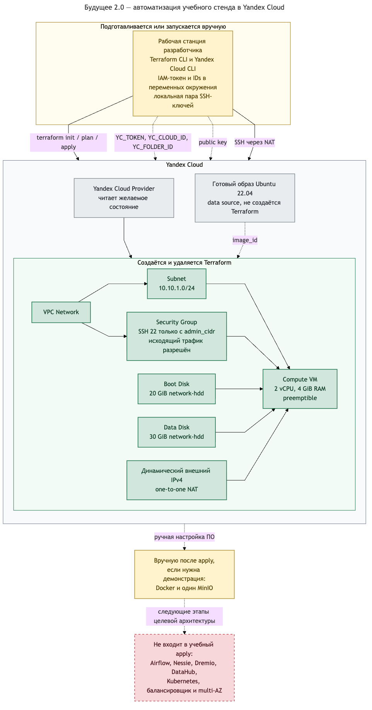
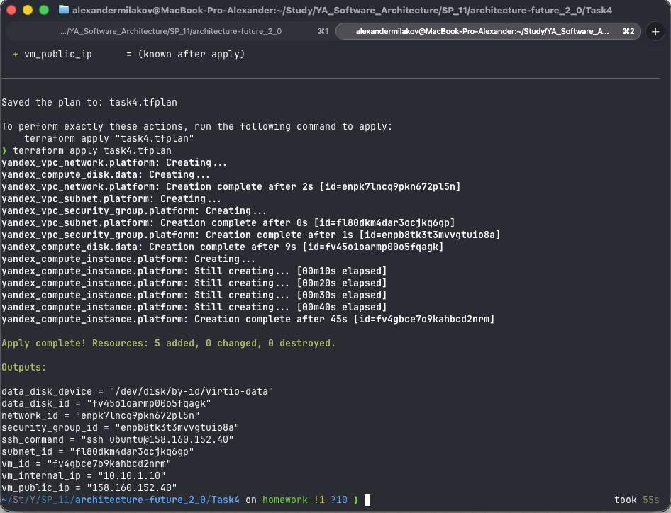

# Задание 4. Учебная инфраструктура в Yandex Cloud

В Terraform реализован минимальный одноузловой стенд платформы данных. Он нужен для проверки автоматизированного создания IaaS-ресурсов и не заменяет production-архитектуру из предыдущих заданий.

## Диаграмма автоматизации

Исходник диаграммы: [`task4_diagram.mmd`](./task4_diagram.mmd).



Зелёные компоненты создаются и удаляются Terraform. Жёлтые шаги выполняются вручную, серые компоненты уже существуют в Yandex Cloud, а красным отмечены элементы целевой платформы, которые не входят в учебное развёртывание.

## Состав конфигурации

- [`main.tf`](./main.tf) — provider, сеть, подсеть, Security Group, VM и диски;
- [`variables.tf`](./variables.tf) — типы, описания и проверки входных значений;
- [`outputs.tf`](./outputs.tf) — идентификаторы ресурсов, IP-адреса и команда SSH;
- [`terraform.tfvars`](./terraform.tfvars) — параметры учебного стенда;
- [`justification.md`](./justification.md) — обоснование состава и ограничений.

## Результат развёртывания

Команда `terraform apply` успешно создала пять ресурсов: сеть, подсеть, Security Group, дополнительный диск и виртуальную машину.



Полный ход проверки, включая `plan`, `apply`, подключение к VM по SSH и последующее удаление ресурсов, сохранён в файле [`log.txt`](./log.txt).

## Подготовка к запуску

В `terraform.tfvars` нужно заменить тестовое значение `admin_cidr` на свой публичный IPv4 с маской `/32` и проверить путь `ssh_public_key_path`.

Учётные данные не записываются в репозиторий. Провайдер получает их из переменных окружения:

```bash
export YC_TOKEN=$(yc iam create-token)
export YC_CLOUD_ID=$(yc config get cloud-id)
export YC_FOLDER_ID=$(yc config get folder-id)
```

Проверка и развёртывание выполняются из директории `Task4`:

```bash
terraform init
terraform fmt -check
terraform validate
terraform plan -out=task4.tfplan
terraform apply task4.tfplan
```

После успешного `apply` Terraform выведет публичный и внутренний адреса VM и готовую команду SSH.
